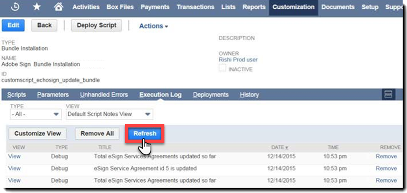

# [!DNL NetSuite] Guia de instalação e personalização (v4.0.4) {#install-customize-NetSuite}

## Visão geral {#overview}

Adobe Sign para [!DNL NetSuite] fornece uma integração completa de assinatura eletrônica com [!DNL NetSuite]. Você pode usar o Adobe Sign para [!DNL NetSuite] integração para enviar contratos, cotações e outros documentos, que exigem assinaturas eletrônicas, para destinatários diretamente do [!DNL NetSuite]. Você pode criar e enviar contratos do Adobe Sign de clientes, clientes potenciais, cotações e outros [!DNL NetSuite] registros. Atualizações do Adobe Sign [!DNL NetSuite] com o status dos contratos e armazena os contratos com os [!DNL NetSuite] registros quando forem executados. Você pode exibir o histórico de todos os contratos enviados de [!DNL NetSuite] dentro do produto.

Consulte o [Notas de versão do Adobe Sign para NetSuite](https://experienceleague.adobe.com/docs/sign-integrations/using/netsuite/release-notes.html?lang=en) para obter mais informações.

## Instalar o pacote e configurar o OAuth {#install}

Apenas um [!DNL NetSuite] administrador pode instalar ou atualizar o pacote. Para configurar o OAuth, o [!DNL NetSuite] O administrador deve ter acesso de administrador ao Adobe Sign. Antes de instalar o pacote na sua conta de produção, você deve instalar e testar o pacote em um [!DNL NetSuite] Conta da sandbox.

Consulte [Criar um contrato do Adobe Sign](#createagreement) para obter mais informações sobre testes.

>[!CAUTION]
>
>Os clientes que atualizarem para a v4.0.4 NÃO devem remover sua chave de API existente.
>
>Consulte [Definir preferências personalizadas](#configure) para obter mais informações sobre como a chave de API é usada.

### Instalar o pacote pela primeira vez

1. Navegue até [!UICONTROL **Personalização > SuiteBundler > Pesquisar e instalar pacotes**].

1. No menu *Buscar e instalar pacotes* página, digite **Adobe Sign** como palavra-chave e selecione **[!UICONTROL Search]**.

1. Selecione o **Adobe Sign** nome do pacote.

   

1. No menu *[!UICONTROL Detalhes do pacote]* , selecione **[!UICONTROL Instalar]**.
1. No menu *[!UICONTROL Instalação do pacote de visualização]* , selecione **[!UICONTROL Pacote de instalação]**.

   (Não é necessário alterar nenhum dos valores padrão na página)

   

1. Na caixa de diálogo Instalar exibida, selecione **[!UICONTROL OK]** para continuar.

   Durante o processo de instalação, o status do pacote é exibido como *[!UICONTROL Pendente]*.

   

1. Para exibir um status atualizado, selecione **[!UICONTROL Atualizar]**.

   Após a conclusão da instalação do pacote, *Adobe Sign para[!DNL NetSuite]* é exibido na *[!UICONTROL Pacotes instalados]* página.

   

1. Se você já for uma conta de cliente da Adobe Sign, siga as etapas para  [Configurar o OAuth após a instalação ou atualização](#oauth).

   Se você não tiver uma conta da Adobe Sign, poderá [cadastrar-se para obter uma avaliação corporativa](https://esign.adobe.com/adobe-sign-netsuite-trial-registration.html) para testar o sistema. Siga as etapas de registro online para ativar sua conta da Adobe Sign.

## Configurar o OAuth após a instalação ou atualização {#oauth}

O Adobe Sign usa o OAuth 2.0 para autenticar sua conta do Adobe Sign no [!DNL NetSuite].

Este protocolo autoriza o [!DNL NetSuite] para se comunicar com a Adobe Sign sem solicitar sua senha. Como informações confidenciais não estão sendo compartilhadas diretamente entre os aplicativos, sua conta tem menos probabilidade de ficar comprometida.

Essa autenticação não afeta sua implementação, mas você deve fazer uma configuração única após instalar ou atualizar o pacote em sua conta de produção ou sandbox.

O [!DNL NetSuite] o administrador que configura o OAuth também deve ter acesso de administrador no nível de conta ao Adobe Sign.

1. No [!DNL NetSuite], navegue até a *Configuração do Adobe Sign* página de lista.

1. Procurar **[!UICONTROL Configuração do Adobe Sign]** (um tipo de registro personalizado) usando o campo Pesquisar no cabeçalho.

1. Na página Resultados da Pesquisa, selecione **Exibir** para *Configuração do Adobe Sign* registro.

   

1. Na página Lista de configurações do Adobe Sign, selecione **[!UICONTROL Exibir]** para *Uso do OAuth para acessar APIs do Adobe Sign* registro.

   

1. Na página Adobe Sign Config, selecione **[!UICONTROL Fazer Logon Com O Adobe Sign]**

   

1. Na página de logon do Adobe Sign exibida, insira suas credenciais e selecione **[!UICONTROL Fazer logon]**.

   

1. Na página Confirmar Acesso (para OAuth) exibida, selecione **[!UICONTROL Permitir acesso]**

   

1. Quando a autorização for concluída, você será redirecionado de volta à página Configuração do Adobe Sign no [!DNL NetSuite], como mostrado abaixo.

   

   >[!NOTE]
   >
   >Ao configurar o OAuth em sua conta do Sandbox, você pode encontrar o erro &quot;Não foi possível determinar a ID de composição do cliente&quot; quando a autorização é concluída.
   >
   >
   >Para continuar, você deve alterar a parte de domínio da conta do URL (system.netsuite.com) no navegador para apontar de volta para o [!DNL NetSuite] Sandbox, como se segue:
   >
   >
   >Alterar:
   >
   >
   >system.netsuite.com/app/site/hosting/scriptlet.nl?script=745&amp;deploy=1&amp;web_access_point=https://echosign.com
   >
   >
   >Para:
   >
   >
   >sistema.**sandbox.** netsuite.com/app/site/hosting/scriptlet.nl?script=745&amp;deploy=1&amp;web_access_point=https://echosign.com

## Atualizar o pacote (usuários existentes)

[!DNL NetSuite] atualizações de pacotes são lançadas regularmente pelo Adobe. Usuários existentes do Adobe Sign para [!DNL NetSuite] a integração pode ser atualizada para o pacote mais recente.

>[!CAUTION]
>
>Os clientes que atualizarem para uma versão mais recente NÃO devem remover a chave de API existente.
>
>Consulte [Definir preferências personalizadas](#configure) para obter mais informações sobre como a chave de API é usada.

### Pré-requisitos {#prerequisites}

O tempo necessário para atualizar para o pacote v4.0.4 depende do número de contratos que atualmente têm um status &quot;Enviado para assinatura&quot;. Geralmente, leva de 7 a 10 minutos para atualizar 100 contratos. Anote o número de registros para estimar o tempo de atualização.

Para determinar o número de contratos enviados para assinatura:

1. Navegue até **[!UICONTROL Personalização > Listas, Registros e Arquivos > Tipos de Registro]** e localize *Contrato do Adobe Sign.*

   Ou procure Contratos do Adobe Sign na barra de pesquisa.

1. Para a [!UICONTROL Contratos do Adobe Sign] registro, selecione **[!UICONTROL Search]**.

   

1. No menu **[!UICONTROL Status]** , selecione **[!UICONTROL Enviado para assinatura]** e selecione **[!UICONTROL Enviar]**.

   

   Anote o número de registros para estimar o tempo de atualização.

   

### Atualizar o pacote {#updating-the-bundle}

1. Navegue até **[!UICONTROL Personalização > SuiteBundler > Pesquisar e instalar > Lista]** e localize seu pacote atual, conforme mostrado abaixo.

   >[!NOTE]
   >
   >Se houver uma nova versão do pacote, um ícone de ponto de exclamação será exibido à direita da *Versão* número do pacote atual.

1. No menu suspenso Ação, selecione **[!UICONTROL Atualizar]**.

   

1. Na página Visualizar atualização do pacote, selecione **[!UICONTROL Pacote de atualização]** sem alterar nenhum dos valores padrão exibidos na página.

   Durante a instalação, o status do pacote é exibido como *Pendente*.

   .

   >[!NOTE]
   >
   >Ao atualizar o pacote, você pode receber uma mensagem de aviso conforme mostrado abaixo. Se você não tiver personalizado seu [!DNL NetSuite] Registros de assinatura eletrônica, você pode continuar. Se não tiver certeza, sugerimos que instale o pacote em uma conta da Sandbox para testá-lo primeiro antes de atualizar o pacote em uma conta de produção.

   

1. Para exibir um status atualizado, selecione **[!UICONTROL Atualizar]**.

   

   >[!NOTE]
   >
   >Se a atualização estiver demorando devido a vários contratos com um *Enviado para assinatura* , você pode verificar o **[!UICONTROL Log de Execução]** subguia para a *Instalação do pacote Adobe Sign* para determinar o andamento da atualização. Consulte [Determinar o andamento da atualização](#determineprogress) para obter mais informações.

   Após a conclusão da atualização do pacote, *Adobe Sign para[!DNL NetSuite]* é exibido na *Pacotes instalados* página.

   

## Configurar o pacote {#configure}

### Definir preferências personalizadas  {#set-custom-preferences}

Você pode usar preferências personalizadas para especificar como os contratos são criados e armazenados no [!DNL NetSuite]. Além disso, a *Provisionamento automático de usuários no Adobe Sign* preferência permite especificar se [!DNL NetSuite] os usuários são provisionados automaticamente nos serviços do Sign quando enviam contratos de [!DNL NetSuite].

1. Navegue até **[!UICONTROL Configuração > Empresa > Preferências Gerais]**.
1. Role a página para baixo e selecione a **[!UICONTROL Preferências personalizadas]** subguia.

   

1. Ative e configure suas preferências do Adobe Sign conforme necessário:

   * **Insira a chave da API do EchoSign para sua conta**: Não adicione ou edite nenhum valor neste campo.
   * **Usar contato do registro principal como signatário**: Se ativado, o contato do registro principal é padronizado como o primeiro signatário quando os contratos são criados. O remetente pode remover ou editar facilmente o signatário padrão ou adicionar outros signatários ao contrato antes de enviar.
   * **Usar Trans. Entrar em contato como signatário, se presente**: Essa preferência é válida somente se a *Usar contato do registro principal como signatário* também está ativada. Se ativado, ao gerar um contrato a partir de um Registro de transação (por exemplo, Cota), o contato principal da transação assume como padrão o primeiro signatário. Consulte [Registros de transação](#transrecords) para obter mais informações. Se não houver contato principal da Transação ou se estiver enviando de [!DNL NetSuite] registro de objeto (por exemplo, registro de Cliente, registro de Parceiro), o destinatário padrão é o contato principal do email do cliente. O remetente pode remover ou editar facilmente o signatário padrão ou adicionar outros signatários ao contrato antes de enviar.
   * **Permitir marcação de destinatários como aprovadores**: Se ativado, os remetentes podem marcar destinatários como aprovadores. Os destinatários marcados como aprovadores podem revisar e aprovar contratos, mas não é necessário que eles os assinem. Os aprovadores podem ser solicitados a inserir dados nos campos durante o processo de aprovação.
   * **ID da Pasta do Contrato Preferencial**: Usado para especificar a pasta onde os contratos finais assinados são armazenados. Se você não definir um valor para esse campo, os contratos finais assinados são salvos na mesma pasta do arquivo do documento original por padrão. A ID da Pasta deve ser um número.
   * **Anexar Automaticamente PDF da Transação**: Se ativada, os PDF de transação são anexados automaticamente aos contratos quando novos contratos são criados a partir dos registros de transação.
   * **Adicionar PDF assinado como (anexo ou link)**: Se *Lista* estiver selecionado na lista suspensa, o PDF assinado é adicionado automaticamente como um link para o arquivo. Se *Anexo* é selecionado na lista suspensa, o PDF assinado é armazenado em [!DNL NetSuite] como um anexo no registro do contrato.
   * **Incluir PDF de trilha de auditoria com contrato**: Se ativado, os PDF de trilha de auditoria são anexados automaticamente aos registros do contrato após a assinatura dos contratos.
   * **O método de verificação de identidade se aplica a**: A ativação de qualquer um dos métodos de verificação de identidade determina a quem o método de verificação de identidade é aplicado. As opções são *Todos os signatários, somente signatários externos* ou *Somente signatários internos*.

   **Métodos de verificação de identidade** {#identity-verification-methods}

   Métodos de verificação de identidade ativados podem ser selecionados ao criar um contrato. Se mais de um método de verificação de identidade estiver ativado aqui, a página Contrato do Adobe Sign exibirá uma **[!UICONTROL Verificar identidade do signatário]** opção.

   * **Ativar senha necessária para assinar**: Exigir que os signatários insiram uma senha única especificada.

   * **Ativar autenticação baseada em conhecimento**: Exija que os signatários forneçam seu nome, endereço e, opcionalmente, os últimos quatro dígitos da SSN e respondam a uma lista de perguntas que verificam as informações fornecidas. Disponível apenas nos Estados Unidos.

   * **Habilitar Autenticação de Identidade Web**: Exigir que os signatários verifiquem sua identidade fazendo logon em um dos seguintes sites: Facebook, Google, LinkedIn, Microsoft Live, Twitter ou Yahoo!.

   * **Provisionamento automático de usuários no Adobe Sign**: Se ativado, os usuários que enviam contratos em [!DNL NetSuite] são provisionados automaticamente com uma conta de usuário da Adobe Sign.

1. Selecionar **[!UICONTROL Salvar]** para salvar suas preferências.

## Configurar atualizações automáticas de status {#asu}

O pacote de integração do Adobe Sign permite receber atualizações automaticamente em [!DNL NetSuite] sobre o status dos contratos enviados por [!DNL NetSuite]. Quando esse recurso está ativado, [!DNL NetSuite] sempre reflete o status de seus contratos. Você pode ativar as atualizações automáticas de status da seguinte maneira:

1. Navegue até **[!UICONTROL Configurar > Empresa > Ativar recursos].**
1. Selecione o **[!UICONTROL SuiteCloud]** subguia.
1. Ative as seguintes opções:

   * Na seção SuiteBuilder, ative **[!UICONTROL Registros personalizados]** opção.

   * Na seção SuiteScript, ative o **[!UICONTROL SuiteScript de Cliente]** e **[!UICONTROL SuiteScript de servidor]** e concordar com os termos de serviço para ambos.

1. Selecionar **[!UICONTROL Salvar]**.

   Suas opções são definidas conforme mostrado na imagem.

   

## Objetos e tipos de registro {#objects}

O pacote de integração do Adobe Sign já expõe o objeto Contrato do Adobe Sign com muitos [!DNL NetSuite] objetos, incluindo: Registros de clientes, estimativas, clientes potenciais, oportunidades e parceiros. Você também pode usar o pacote do Adobe Sign com outros tipos de registro, incluindo registros personalizados.

A guia Contrato pode ser exibida com dois tipos de [!DNL NetSuite] registros: Registros de entidade e de transação. Geralmente, presumimos que um registro de Transação é um registro (como cotação) que pode ser convertido em um documento PDF; Considerando que um registro de Entidade não pode ser convertido em um PDF.

## Registros de transação {#transrecords}

Se o contrato for criado a partir de um registro de Transação, o primeiro documento no registro de contrato será a versão PDF do registro de origem e o primeiro destinatário será o endereço de email do registro. Se não quiser que o primeiro documento seja uma versão PDF do registro de origem, vá para **[!UICONTROL Configuração > Empresa > Preferências gerais > subguia Preferências personalizadas]** e desative o **[!UICONTROL Anexar Automaticamente PDF da Transação]** opção. Consulte [Definição de Preferências Personalizadas](#configure) para obter mais informações.

Em Preferências personalizadas, você também pode ativar o **[!UICONTROL Usar Trans. Entrar em contato como primeiro signatário]** se desejar que o contato principal da transação seja adicionado automaticamente como o primeiro signatário. Quando associado a um registro de Transação, exibe o **[!UICONTROL Contratos]** e o **[!UICONTROL Send for Signature]** botões.

## Registros de entidade {#entity-records}

Se o contrato for criado a partir de um registro de entidade, o primeiro destinatário será o endereço de email do registro. Quando associado a um registro de Entidade, somente a guia Contratos é exibida.

## Personalizar o pacote {#customize}

A personalização do pacote inclui o seguinte:

* Implantar os scripts da subguia Contratos e o botão Send for Signature para os tipos de registro apropriados.
* Definindo permissões de função para os tipos de registro do Adobe Sign.
* Modificar permissões para conceder acesso ao *Contratos* subguia e a *Send for Signature* botão.

### Configurar contratos do Adobe Sign para tipos de registro adicionais  {#configuring-adobe-sign-agreements-for-additional-record-types}

Para implantar o *Contratos* subguia e a *Send for Signature* para os tipos de registro apropriados:

1. Navegue até **[!UICONTROL Personalização > Scripts > Scripts].**

1. No menu *Scripts* listar exibida, localize o script que você deve disponibilizar e selecione ****[!UICONTROL Exibir]****.

   * Para adicionar o *Send for Signature* , selecione **[!UICONTROL Botão Estimativa do Adobe Sign]** script.

   * Para adicionar o *Contratos* , selecione **[!UICONTROL Carregador do Contrato Adobe Sign]** script.

1. Na página Script, selecione **[!UICONTROL Implantar Script]**.

   

1. Na página Disponibilização de Script, faça o seguinte:

   * No menu *Aplica-se a* selecione o tipo de registro.
   * Opcionalmente, informe a ID de implantação do script.

      Consulte o *Criação de uma ID de implantação de script personalizado* tópico no [!DNL NetSuite] Centro de Ajuda para obter mais informações. Se você não inserir uma ID, uma será gerada.

   * Verifique o **[!UICONTROL Implantado]** caixa de seleção.

   

   * Definir *Status* para **[!UICONTROL Lançado]**.

      Você não deve especificar um *Tipo de evento* ou *Nível de Log*.

   * No menu [!UICONTROL *Executar como função]*, selecione **[!UICONTROL Executar como administrador]**.

   * Com o **[!UICONTROL Público-alvo]** subguia ativo (ativo por padrão), selecione as funções ou usuários específicos aos quais você deseja conceder acesso. Se você deseja conceder acesso a todas as funções e usuários, ative os respectivos **[!UICONTROL Selecionar tudo]** opções.

   * Selecionar **[!UICONTROL Salvar]**. Quando a confirmação de alteração for exibida, selecione **[!UICONTROL Voltar]**.

1. selecionar **[!UICONTROL Lista]** na parte superior da página Disponibilização de Script para voltar ao *Scripts* página de lista.
1. Repita as etapas 2 e 3 acima para o outro script.

## Definição de permissões de função para tipos de registro do Adobe Sign {#setting-role-permissions-for-adobe-sign-record-types}

Mais [!DNL NetSuite] as funções devem ter permissão para usar o Adobe Sign sem personalização adicional. No entanto, você pode conceder permissões para quaisquer funções personalizadas adicionais que foram criadas.

1. Navegue até **[!UICONTROL Personalização > Listas, Registros e Arquivos > Tipos de Registros]**.

   

   >[!NOTE]
   >
   >Se você não vir o *Tipos de registro* item, navegue até **[!UICONTROL Configuração > Empresa > Ativar recursos > guia Suite Cloud]** e habilite o *Registros personalizados* opção.

1. No menu *Tipos de registro* , selecione **[!UICONTROL Contrato do Adobe Sign]** para selecioná-lo

   

1. No menu *Tipo de Registro Personalizado* , selecione **[!UICONTROL Usar lista de permissões]** do *Tipo de acesso* suspenso.

   

   >[!NOTE]
   >
   >O *Contrato do Adobe Sign* é o único tipo de registro do Adobe Sign que exigiu a *Usa Lista de Permissões* tipo de acesso.
   >
   >
   >Consulte a etapa 6 para obter instruções sobre como definir o tipo de acesso para os outros tipos de registro do Adobe Sign.

1. Selecione o **[!UICONTROL Permissões]** subguia.

   A lista de funções e permissões é exibida.

   

1. Defina as permissões da seguinte maneira para as funções personalizadas adicionais adicionadas ao &quot;[!UICONTROL Contrato do Adobe Sign]&quot; tipo de registro.

   >[!NOTE]
   >
   >Consulte o *[Configurando uma lista de permissões para um tipo de registro personalizado](https://system.netsuite.com/app/help/helpcenter.nl?fid=section_N2879931.html)* tópico no Centro de Ajuda do NetSuite para obter mais informações

   1. Selecione a função no menu *Função* lista.
   1. Definir *Nível* para **[!UICONTROL Completo]**.
   1. Definir *Formulário Padrão* para **[!UICONTROL Formulário de contrato personalizado do EchoSign]**.
   1. Selecionar **[!UICONTROL Restringir formulário]** caixa de seleção.
   1. Selecionar **[!UICONTROL Adicionar]** para salvar as alterações da linha de função.

   

   A nova linha é exibida conforme mostrado abaixo:

   

   Repita as etapas de a a e acima para todas as funções personalizadas adicionais.

   * selecionar **[!UICONTROL Salvar]** no *Tipo de Registro Personalizado* quando as permissões para todas as funções tiverem sido definidas.
   O *[!UICONTROL Tipo de Registro do Cliente]* reexibe a página.

1. Repita as etapas de 1 a 3 acima para definir o *Tipo de acesso* para todos os outros tipos de registro do Adobe Sign para

   **[!UICONTROL Nenhuma Permissão Necessária].** Isso se aplica aos seguintes tipos de registro:

   * Configuração do Adobe Sign
   * Documento do Adobe Sign
   * Evento do Adobe Sign
   * Idioma do Adobe Sign
   * Erros de Script do Adobe Sign
   * Contrato assinado Adobe Sign
   * Signatário do Adobe Sign

### Conceder acesso à guia Contrato e ao botão Send for Signature  {#granting-access-to-the-agreement-tab-and-send-for-signature-button}

O pacote de integração do Adobe Sign já expõe o objeto Contrato do Adobe Sign com muitos [!DNL NetSuite] objetos (Cliente, Estimativa [Cotação], Lead e muito mais). O *Contrato* subtab é automaticamente ativada para os seguintes tipos de objetos: Cliente, Cliente Potencial, Oportunidade, Parceiro, Cliente Potencial, Cotação e Fatura de Fornecedor.

O *[!UICONTROL Send for Signature]* é ativado automaticamente **o[!UICONTROL somente para o objeto Citação]**.

[!DNL NetSuite] os administradores podem ampliar a capacidade de criar contratos para objetos adicionais do CRM modificando as permissões para adicionar o *Contrato* subguia, *Send for Signature* ou ambos para esses objetos.

#### Modificando permissões para conceder acesso ao botão Send for Signature  {#modifying-permissions-to-grant-access-to-the-send-for-signature-button}

1. Navegue até **[!UICONTROL Personalização > Scripts > Scripts]**.

   O *Scripts* será exibida.

   * Se necessário, use os filtros para localizar os scripts do Adobe Sign

1. No menu *Scripts* , localize o *Botão Estimativa do Adobe Sign* script (controla o *Send for Signature* ), selecione **Exibir**.

   

1. No menu *Script* faça o seguinte:

   * selecione o **[!UICONTROL Implantações]** subguia

   * Em &quot;*Aplica-se a*&quot; selecione o link da entidade que deseja modificar.

      * **[!UICONTROL Cotação]** neste exemplo

   

   * selecione o **[!UICONTROL Editar]** botão na *Implantação de Script* página

   

   * Com o **[!UICONTROL Público-alvo]** subguia ativo, selecione as funções ou usuários específicos aos quais você deseja conceder acesso.

      * Se você deseja conceder acesso a todas as funções e usuários, ative os respectivos **[!UICONTROL Selecionar tudo]** opções
   * selecionar **[!UICONTROL Salvar]**

   

#### Modificar permissões para conceder acesso à guia Contratos  {#modifying-permissions-to-grant-access-to-the-agreements-tab}

1. Navegue até **[!UICONTROL Personalização > Scripts > Scripts]**
1. No menu [!UICONTROL Scripts] , localize o *[!UICONTROL Carregador do Contrato Adobe Sign]* script (controla o *Guia Contratos*) e selecione **[!UICONTROL Exibir]**.
1. No menu *Script* faça o seguinte:

   1. Selecione o **[!UICONTROL Implantações]** subguia
   1. Em &quot;*[!UICONTROL Aplica-se a]*&quot; selecione o link da entidade para a qual você deseja modificar o acesso
   1. No menu *[!UICONTROL Implantação de Script]* , selecione o **[!UICONTROL Editar]** botão
   1. Com o **[!UICONTROL Público-alvo]** subguia ativo (ativo por padrão), selecione as funções ou usuários específicos aos quais você deseja conceder acesso. Se você deseja conceder acesso a todas as funções e usuários, ative os respectivos **[!UICONTROL Selecionar tudo]** opções
   1. selecionar **[!UICONTROL Salvar]**

## Uso do Adobe Sign para [!DNL NetSuite] pacote

Para enviar contratos de [!DNL NetSuite] e receber atualizações sobre esses contratos, os usuários devem ter a mesma ID de logon (endereço de email) no [!DNL NetSuite] e no Adobe Sign.

### Criar um contrato do Adobe Sign

Depois de instalar um novo pacote em uma conta de sandbox ou de produção, você deve testar o pacote criando um novo contrato. Você pode criar contratos do Adobe Sign a partir de um registro de entidade, de um registro de transação ou como um contrato independente.

>[!NOTE]
>
>O processo para criar um contrato difere um pouco dependendo de como ele é criado. O processo geral envolve especificar as opções do seu contrato, adicionar um ou mais documentos do contrato e especificar os destinatários. O processo descrito abaixo pressupõe que você esteja criando o contrato a partir de um registro de cliente.

1. Selecione ou crie um registro de cliente do qual gostaria de enviar um contrato ou selecione outro [!DNL NetSuite] que tenha a guia Contratos ativada.

1. No registro, selecione o **[!UICONTROL Contratos]** subguia.
1. Selecionar **[!UICONTROL Novo Contrato]**.

   

1. No menu *[!UICONTROL Contrato do Adobe Sign]* , selecione **[!UICONTROL Editar]**.

   

1. Especifique as opções do seu contrato da seguinte maneira:

   * **Nome do contrato** — Digite um nome para o contrato.
   * **Mensagem**-Insira uma mensagem personalizada para o destinatário.
   * **Tipo de assinatura** — Selecione o tipo de assinatura aceito para o documento. As opções são *Assinatura eletrônica* e *Assinatura por fax*.

   * **Também devo assinar este contrato** — Ative essa opção para indicar que o remetente também precisa assinar o contrato.
   * **Ordem de assinatura**-Se a *Também devo assinar este contrato* estiver ativada, selecione a ordem na qual o remetente e os destinatários devem assinar. As opções são &quot;Eu assino, os destinatários assinam&quot;, &quot;Os destinatários assinam, depois eu assino&quot; e &quot;Nenhum&quot;.

   * **Visualizar documentos ou posicionar assinaturas (ou campos de formulário)** — ative esta opção para permitir que os remetentes visualizem o contrato e adicionem campos (assinatura arrastada e solta, campos iniciais e outros campos de formulário) ao contrato antes que ele seja enviado aos destinatários.
   * **Verificar identidade do signatário** — Ative essa opção e selecione uma das seguintes opções de verificação de identidade

      * Essa opção é exibida somente quando mais de um dos três métodos de verificação de identidade do signatário listados abaixo está ativado em Preferências personalizadas. (Consulte [Definir preferências personalizadas](#customize) para obter mais informações.) Se apenas uma preferência estiver ativada, o **[!UICONTROL Verificar identidade do signatário]** não é exibida.

   **Métodos de verificação de identidade**

   * **Senha necessária para assinar** — Exigir que signatários insiram uma senha única especificada por você.
   * **Autenticação baseada em conhecimento** — Exigir que os signatários forneçam seu nome, endereço e, opcionalmente, os últimos quatro dígitos da SSN e respondam a uma lista de perguntas, verificando as informações fornecidas. Disponível apenas nos Estados Unidos.
   * **Autenticação de identidade da Web** — exija que os signatários verifiquem sua identidade fazendo logon em um dos seguintes sites: Facebook, Google, LinkedIn, Twitter, Yahoo! ou Microsoft Live.
   * **Senha Necessária Para Exibir PDF** — Ative essa opção para exigir que um destinatário insira uma senha antes de abrir uma PDF do contrato ou do contrato assinado. O arquivo PDF que é enviado a todos é criptografado e requer a senha para abri-lo. Não perca sua senha, pois ela não é recuperável. Caso perca a senha, você deve excluir a transação e começar novamente.
   * **Senha/Confirmar Senha** — Se a *Senha Necessária Para Exibir PDF* estiver ativada, insira a senha que deve ser usada para visualizar o contrato.
   * **Lembrar destinatários de assinar** — Especifique se e com que frequência os lembretes são enviados aos destinatários. As opções são *Nunca*, *Diariamente* ou *Semanalmente*.
   * **Idioma:** Especifique o idioma em que a página de assinatura e as notificações por email são exibidas aos destinatários.
   * **Hospedar a assinatura do primeiro signatário** — Ative essa opção para permitir que o remetente hospede a assinatura presencial do primeiro signatário.
   * **Dias até o prazo de assinatura** — Insira um número inteiro para indicar o prazo de assinatura do contrato (data de hoje + número de dias).
   * **Registro Pai** — Opcionalmente, selecione um registro pai para vinculá-lo ao contrato.

   

1. Selecione o **[!UICONTROL Documentos]** guia.

   

1. No menu *Documentos* subguia, anexe um documento existente do gabinete de arquivos usando o *Documento do Adobe Sign* e selecione **[!UICONTROL Anexar]**.

   Ou clique em **[!UICONTROL Novo documento do Adobe Sign]** para acessar o *[!UICONTROL Documento do Adobe Sign]* e digite o nome de um documento na caixa de texto [!DNL NetSuite] arquivo, selecione arquivos do seu registro de Transação (se aplicável) ou anexe um novo documento.

   Você pode adicionar vários documentos a um contrato.

1. Selecionar **[!UICONTROL Destinatários]** subguia e especifique o destinatário selecionando na lista de contatos ou digitando um endereço de email.

   

   Cada um dos destinatários pode ser marcado como Signatário ou CC. Se a *Permitir marcação de destinatários como aprovadores Signatários* a preferência personalizada estiver ativada, os destinatários também podem ser marcados como Aprovadores. Consulte [Definir preferências personalizadas](#customize) para obter mais informações.

   * **Signatários** deve assinar o contrato.
   * **Aprovadores** deve aprovar, mas não assinar, o contrato e, opcionalmente, pode adicionar dados a um contrato.
   * **Destinatários copiados** são notificados sobre atualizações do contrato e quando o contrato é assinado e concluído. Os destinatários CC não fazem parte do processo de assinatura ou aprovação.

      Se a *Usar contato do registro principal como signatário* a preferência personalizada é ativada sozinha ou em conjunto com a *Usar Trans. Entrar em contato como signatário* , o primeiro destinatário é assumido como padrão, mas pode ser alterado.

1. Selecionar **[!UICONTROL Adicionar]** após inserir cada destinatário.

1. Selecionar **[!UICONTROL Salvar]** para salvar o contrato.

### Enviar contratos para assinatura

Quando o contrato estiver pronto para ser enviado, selecione o **[!UICONTROL Send for Signature]** botão.

* Se a *Visualizar documentos ou posicionar assinaturas* estiver ativada, clique em **[!UICONTROL Send for Signature]**. Na janela aberta, visualize o documento ou arraste os campos de formulário até o documento antes de enviá-lo. Selecionar **[!UICONTROL Enviar]** para enviar o contrato ao destinatário.

* Se a *[!UICONTROL Hospedar assinatura para o primeiro signatário]* estiver ativada, clique em **[!UICONTROL Send for Signature]**. Na janela aberta, permita que o signatário assine o documento com o remetente presente.

   A *Hospedar assinatura para signatário atual* também é exibido ao lado do *Hospedar assinatura para o primeiro signatário* , que pode ser acessado até que o documento seja assinado. Use este link para hospedar a assinatura do contrato para vários signatários ou para reabrir a janela pop-up se ela tiver sido fechada acidentalmente.

Depois que o contrato é enviado, os destinatários recebem um email informando-os dos documentos que estão aguardando a assinatura.

Depois que os destinatários assinam o documento, o remetente recebe uma notificação por email informando que o documento foi assinado.

#### Enviar de uma Cotação

O Adobe Sign tem uma integração direta com as cotações no [!DNL NetSuite] para que uma PDF da cotação seja gerada automaticamente e anexada ao registro do contrato.

Ao exibir uma Cotação, selecione **[!UICONTROL Send for Signature]**. Ele gera e exibe a cotação anexada ao contrato. Você também pode adicionar o *Send for Signature* para outros tipos de registro de transação. Consulte [Objetos e tipos de registro](#objects) para obter mais informações.

### Monitorar status e enviar lembretes

Depois de enviar um contrato:

* O status do documento muda para *Enviado para assinatura* na seção Detalhes do contrato
* O *Send for Signature* é substituído pelos três botões seguintes:

   * **Atualizar status** — Para atualizar manualmente o status se as atualizações de status não tiverem sido configuradas. Consulte [Configurando atualizações automáticas de status](#asu) para obter mais informações.
   * **Enviar lembrete** — Para enviar um lembrete ao signatário atual.
   * **Cancelar Contrato** — Para cancelar um contrato. Um contrato pode ser cancelado após ser enviado para assinatura, se todos os destinatários ainda não tiverem assinado.

Um novo *Eventos* é exibida no registro do contrato, onde você pode monitorar o status do contrato.

Você pode ver um histórico dos eventos do contrato, que inclui informações sobre quando o contrato foi enviado, visualizado e assinado.

Após a assinatura do contrato:

* Seu status muda para *Assinado*.
* Você pode vincular novamente ao Registro principal deste contrato usando o link.
* Você pode usar os links de &quot;download&quot; em Documento assinado e Trilha de auditoria para acessar esses documentos.
* Uma *Documento assinado* é exibida para exibir miniaturas do documento assinado.

>[!NOTE]
>
>Depois que um contrato é enviado para assinatura, você não pode editar o registro. Isso é para preservar o registro de eventos.

## Desinstale o pacote

Para desinstalar o pacote, siga as etapas fornecidas no [!DNL NetSuite] Ajuda. Consulte o *[Desinstalando um pacote](https://docs.oracle.com/en/cloud/saas/netsuite/ns-online-help/section_N3400972.html)* tópico no [!DNL NetSuite] Centro de Ajuda para obter mais informações.

Quando você desinstala o pacote, os contratos não assinados são excluídos. Os contratos assinados e seus arquivos de PDF de auditoria correspondentes não são afetados.

NÃO desinstale o pacote se precisar manter seus contratos não assinados.

## Solução de problemas

### Determine o andamento da atualização {#determineprogress}

Se a atualização parecer estar levando mais tempo do que o necessário, você pode verificar a subguia Log de execução do script de instalação do pacote Adobe Sign para determinar o andamento da atualização da seguinte maneira:

1. Navegue até **[!UICONTROL Personalização > Scripts > Scripts]**.
1. No menu [!UICONTROL Scripts] , localize o *[!UICONTROL Instalação do pacote Adobe Sign]* , depois selecione **[!UICONTROL Editar]**.
1. No menu [!UICONTROL Scripts] , selecione o **Log de Execução** subguia.
1. selecionar **Atualizar**.

   O Log de Execução é atualizado para refletir o status. O *Detalhes* exibe o progresso das atualizações em seus contratos.

   

### Resolver problemas de token de acesso

Você pode encontrar uma mensagem &quot;O token de acesso fornecido é inválido ou expirou&quot; ao interagir com contratos.

Isso pode ocorrer pelos seguintes motivos:

* O [!DNL NetSuite]/Administrador do Adobe Sign que configurou o OAuth revogou o token de acesso
* O token de acesso expirou porque nenhum contrato foi enviado de [!DNL NetSuite] nos últimos 60 dias
* O [!DNL NetSuite]/O administrador do Adobe Sign não concluiu com êxito a configuração OAuth inicial

Para resolver esse problema, execute o processo de configuração OAuth novamente. Consulte [Configurando o OAuth após a instalação ou atualização](#oauth) para obter mais informações.

### Resolver problemas de status do documento {#resolvestatus}

Se [atualizações automáticas de status](#asu) estiverem configurados, mas o status do contrato não estiver sendo atualizado após o envio dos contratos, tente o seguinte:

1. Verifique o log de execução da implantação para obter *Atualização externa do Adobe Sign* para ver se você está recebendo chamadas do Adobe Sign da seguinte maneira:

   1. Navegue até **[!UICONTROL Personalização > Script > Implantações de Script]**
   1. No menu *Implantações de Script* , localize o *Atualização externa do Adobe Sign* , depois selecione **[!UICONTROL Editar]**
      1. No menu *[!UICONTROL Implantação de Script]* , selecione o **[!UICONTROL Log de Execução]** subguia.
      * Você deve ver um *Registro de contrato atualizado* entrada para cada ID de contrato

1. Verifique o log de execução da implantação para obter *Atualizar contratos do Adobe Sign* para ver se há erros, como se segue:

   1. Navegue até **[!UICONTROL Personalização > Script > Implantações de Script]**.
   1. No menu [!UICONTROL Implantações de Script] , localize o *[!UICONTROL Atualizar contratos do Adobe Sign]* script com &quot;[!UICONTROL Agendado]&quot; e selecione **[!UICONTROL Editar]**.
   1. No menu [!UICONTROL Implantação de Script] , selecione o **[!UICONTROL Log de Execução]** subguia.
   1. Sob [!UICONTROL Tipo], selecione **[!UICONTROL Erro]** para filtrar os resultados.

1. Por fim, verifique o log de execução para obter *Adobe Sign Manager* para erros, siga as instruções na etapa 2 acima.

### Solucionar erros de tipo MIME  {#resolving-mime-type-errors}

Se você receber um erro de tipo MIME ao enviar um contrato, isso pode ocorrer porque o nome no campo Nome do arquivo não corresponde ao nome do arquivo e à extensão do arquivo carregado. Se você deixar o campo Nome do arquivo em branco, ele será preenchido automaticamente com o nome de arquivo e a extensão corretos.

### Exibir logs de script {#viewing-script-logs}

Você também pode exibir os logs de execução de implantação para scripts que não estão relacionados a problemas de status do documento. Consulte [Resolvendo problemas de status do documento](#resolvestatus) para obter mais informações.

1. Navegue até **[!UICONTROL Personalização > Scripts > Scripts]**.

   O *Scripts* será exibida. Se necessário, use os filtros para localizar o script apropriado.

1. Selecionar **[!UICONTROL Exibir]** para o script correspondente.

1. Selecione o **[!UICONTROL Log de Execução]** na página para exibir o log de script.

## Suporte {#support}

Vá para a [Portal de suporte da Adobe Sign](https://adobe.com/go/adobesign-support-center) para acessar as perguntas frequentes, a documentação, os artigos da base de conhecimento ou entrar em contato com o Suporte da Adobe.
