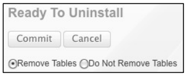
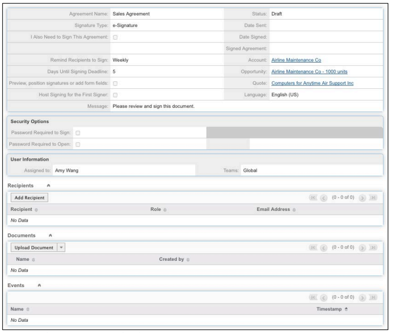
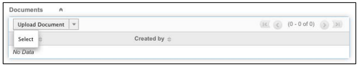
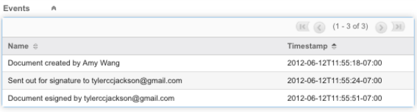

# [!DNL SugarCRM] Manual de instalação {#sugarcrm-install-guide}

[Entre em contato com o Atendimento ao cliente](https://adobe.com/go/adobesign-support-center_br)

Adobe [!DNL EchoSign] para [!DNL SugarCRM] é uma solução líder em contratos de eSignature e Web que fornece automação de assinatura eletrônica em [!DNL SugarCRM] para assinaturas eletrônicas e por fax. Os usuários podem enviar contratos diretamente do SugarCRM, exibir o histórico de contratos e salvar contratos assinados eletronicamente com contas, contatos, cotações e muito mais associados.
O Adobe [!DNL EchoSign] para [!DNL SugarCRM] está disponível para todas as versões suportadas do SugarCRM, incluindo 6.3 a 6.7 para soluções sob demanda ou no local.

Este documento é um guia para que os administradores [!DNL SugarCRM] aprendam como instalar e configurar o Adobe [!DNL EchoSign] para o plug-in [!DNL SugarCRM].

## Instalar este plug-in {#install-plugin}

1. Obtenha o arquivo Adobe [!DNL EchoSign] para [!DNL SugarCRM] a partir da lista [SugarExchange](http://www.sugarexchange.com/product_details.php?product=1123).
1. Faça logon [!DNL SugarCRM] com sua conta de administrador.
1. Vá para **[!UICONTROL Administração]** > **[!UICONTROL Carregador de Módulo]**.

   

1. Para carregar o arquivo de arquivamento do Adobe [!DNL EchoSign] para o plug-in [!DNL SugarCRM], selecione **[!UICONTROL Procurar]**, selecione o arquivo de arquivamento e, em seguida, selecione **[!UICONTROL Carregar]**.
1. Depois que o arquivo for carregado, selecione **[!UICONTROL Instalar]** para iniciar a instalação.
1. Revise os termos e condições e selecione **[!UICONTROL Aceitar]** > **[!UICONTROL Confirmar]**.
1. Se o plug-in for instalado com êxito, a barra de progresso indicará 100% de sucesso.  Se a barra de progresso não atingir 100%, selecione **[!UICONTROL Log de Exibição]** para ver o erro encontrado pelo SugarCRM.

   

1. Após a instalação, vá para **[!UICONTROL Administração > Reparar]** e selecione **[!UICONTROL Reparo rápido e reconstrução]**.

>[!NOTE]
>
>Se você estiver instalando o plug-in no [!DNL SugarCRM] OnDemand, registre um chamado de suporte com [!DNL SugarCRM] para remover temporariamente as restrições do inspetor de pacotes para OnDemand, de modo que o pacote possa ser instalado. Isso faz parte do processo padrão.

## Atualizar o plug-in {#upgrade-plugin}

Se você estiver atualizando o plug-in Adobe [!DNL EchoSign] para [!DNL SugarCRM] para uma versão mais recente, instale o plug-in sem desinstalar a versão anterior.
Depois de atualizar o plug-in, vá para **[!UICONTROL Administração]** > **[!UICONTROL Reparar]** e selecione **[!UICONTROL Reparo e reconstrução rápidos]**.

**Observação:** se você desinstalar um plug-in anterior, não remova as tabelas durante a desinstalação. Além disso, você pode perder os dados do [!DNL EchoSign] contrato.

## Configurar o plug-in {#configure-plugin}

1. Se você já é um cliente de Adobe [!DNL EchoSign], continue com a Etapa 2.

   Se você não tiver uma conta [!DNL EchoSign], [cadastre-se para obter uma avaliação GRATUITA de 14 dias](https://sugarcrmintegration.echosign.com/public/login) e siga as etapas de registro online para ativar sua conta de Adobe [!DNL EchoSign].
1. Faça logon em [conta do Echo Sign](http://www.echosign.com) e siga estas etapas:
   1. Selecione a guia **[!UICONTROL Conta]**.
   1. Selecione **[!UICONTROL API do EchoSign]** no lado inferior esquerdo.
   1. Selecione **[!UICONTROL Ativar acesso à API]** e obtenha a chave da API na página.

   

1. No SugarCRM, vá para **[!UICONTROL Administração]** > **[!UICONTROL Definições do Adobe EchoSign]** e introduza a chave da API no campo **[!UICONTROL Chave da API do EchoSign]**.
1. Opcionalmente, configure o plug-in com as seguintes configurações:

   1. Anexe PDF automaticamente ao criar um contrato a partir de uma Cota: Selecione se deseja anexar automaticamente um PDF da cotação se um usuário [!DNL SugarCRM] criar um contrato do EchoSign a partir do módulo Aspas.
   1. Gerenciar lista de destinatários: Selecione quais módulos aparecem no subpainel Destinatário no módulo [!DNL EchoSign] Contratos. Isso também adiciona o subpainel [!DNL EchoSign] Contratos a esses módulos.
   1. Adicione os botões de envio a esses módulos: Selecione se deseja que o botão/ação Criar [!DNL EchoSign] Contrato seja incluído com as ações principais do módulo Cota.
   1. Selecione **[!UICONTROL Salvar]** para armazenar as configurações.

**Observação:** o Adobe  [!DNL EchoSign] para o  [!DNL SugarCRM] plug-in requer a extensão [ SOAP ](http://www.php.net/manual/en/book.soap.php)PHP. Para ativar o suporte SOAP, configure o PHP com enable-soap.

## Obter atualizações do contrato (para [!DNL SugarCRM] versões 6.3 ou superiores) {#get-agreement-updates}

Para a versão 6.3 e posterior, você pode usar as duas opções a seguir para obter atualizações do contrato. Nas versões anteriores do SugarCRM, por padrão, o plug-in oferece somente o Método de retorno de chamada (Opção 1).

### Opção 1: Configurar o método de retorno de chamada para enviar atualizações para o EchoSign

Se o seu site for público, você pode fazer com que a Adobe EchoSign faça ping na sua instância [!DNL SugarCRM] sempre que um novo evento ocorrer. [!DNL SugarCRM] em seguida, atualiza o status do contrato, os eventos e o download do documento assinado (se assinado) automaticamente e em tempo real. (Se você estiver atrás de um firewall, será necessário listar os endereços IP do servidor [!DNL EchoSign] ou usar o método de Trabalho Agendado de atualização dos contratos do EchoSign descrito na próxima seção deste guia).

1. Vá para **[!UICONTROL Administração]** > **[!UICONTROL Definições da Adobe EchoSign]**.
1. Marque a caixa de seleção **[!UICONTROL Usar o método de retorno de chamada do EchoSign]** para atualizar eventos e status de contratos.
1. Selecione **[!UICONTROL Salvar]**.

### Opção 2: Configurar um trabalho agendado para [!DNL SugarCRM] instâncias atrás de um firewall

O plug-in [!DNL EchoSign] para [!DNL SugarCRM] também pode usar um Trabalho Agendado para consultar [!DNL EchoSign] para obter atualizações de Contratos Enviados para Assinatura. O método de consulta de tarefa agendada pode ser usado se você tiver uma instalação local [!DNL SugarCRM] atrás de um firewall.

Para configurar:

1. Vá para **[!UICONTROL Administração]** > **[!UICONTROL Agendador]**.
1. No menu suspenso da guia, selecione **[!UICONTROL Criar agendador]**.
1. Insira um Nome de Ordem de Produção.
1. No campo Job, selecione **[!UICONTROL Adobe EchoSign Status Updater]**.
1. Defina o trabalho para ser executado com a frequência necessária. Sugerimos que ele seja executado a cada 10 minutos, o que significa que após um contrato ser aberto, lido ou assinado, pode levar até 10 minutos para que [!DNL SugarCRM] seja atualizado com essas informações.

   **Observação:** se você tiver muitos contratos para assinatura, ter essa execução com muita frequência pode fazer com que o sistema seja lento.

   

1. Vá para **[!UICONTROL Administração]** > **[!UICONTROL Definições da Adobe EchoSign]**.
1. Desmarque a caixa **[!UICONTROL Usar método de retorno de chamada do EchoSign]** para atualizar eventos e status de contratos.
1. Selecione **[!UICONTROL Salvar]**.
Nota: Ative Agendadores em [!DNL SugarCRM] para que isso funcione.

Para adicionar contratos do EchoSign a outros módulos [!DNL SugarCRM]:

1. Vá para **[!UICONTROL Administração]** > **[!UICONTROL Studio]**.
1. Na árvore da pasta da coluna esquerda, selecione o módulo para adicionar [!DNL EchoSign] Contratos.
1. Selecione **[!UICONTROL Relações]**> **[!UICONTROL Adicionar Relações]**.
1. No menu suspenso, selecione Type as **[!UICONTROL One to Many]** e Module as **[!UICONTROL EchoSign Agreements]**.
1. Selecione **[!UICONTROL Salvar e Implantar]**.

   

   [!DNL EchoSign] Os contratos agora aparecem no módulo e os contratos podem ser criados e rastreados ali.

   

**Outras etapas de configuração**

* **Ocultar  [!DNL EchoSign] módulos**: Você pode ocultar os módulos  [!DNL EchoSign] Destinatários e  [!DNL EchoSign] Eventos acessando Administração&quot; Exibir guias e subpainéis do módulo e movê-los para a coluna oculta.
* **Desativando packageScan**: Se você ativou o packageScan em seu próprio sistema, é necessário desativá-lo durante a instalação. Se você estiver usando [!DNL SugarCRM] Sob demanda, entre em contato com o [!DNL SugarCRM] suporte para desativar o packageScan para você.

## Desinstale o plug-in {#uninstall-plugin}

1. Faça logon [!DNL SugarCRM] com sua conta de administrador.
1. Vá para **[!UICONTROL Administração]** > **[!UICONTROL Carregador de Módulo]**.
1. Selecione **[!UICONTROL Desinstalar]** ao lado do [!UICONTROL plug-in EchoSign para SugarCRM].
1. Selecione **[!UICONTROL Confirmar]** para iniciar a desinstalação. Você também pode selecionar para remover as tabelas de banco de dados criadas para o plug-in.

   

   Se o plug-in for desinstalado com êxito, a barra de progresso indicará 100% de sucesso. Se a barra de progresso não atingir 100%, selecione [!UICONTROL Log de Exibição] para ver o erro encontrado pelo SugarCRM.

   

## Use Adobe [!DNL EchoSign] para [!DNL SugarCRM] {#use-echosign-for-sugarcrm}

Você pode criar um contrato Adobe [!DNL EchoSign] associado a uma conta, contato, cota ou outros módulos [!DNL SugarCRM]. Você pode anexar arquivos, especificar destinatários e enviar para assinatura. Adobe [!DNL EchoSign] atualiza [!DNL SugarCRM] com o status atual do contrato e armazena o contrato assinado em [!DNL SugarCRM] assim que ele for executado.

### Criar e editar um contrato de Adobe [!DNL EchoSign] {#create-edit-agreements}

Você pode criar contratos por meio do módulo [!DNL EchoSign] Contratos ou por meio de módulos configurados por um administrador [!DNL SugarCRM].

1. Na lista [!UICONTROL Ações] na guia [!UICONTROL Contratos do EchoSign], selecione **[!UICONTROL Criar contrato do EchoSign]**.
1. Na seção principal do [!DNL EchoSign] Contrato, insira as seguintes informações ou selecione uma das várias opções de contrato:

   1. **[!UICONTROL Nome:]** insira um nome para o contrato.
   1. **[!UICONTROL Tipo de assinatura:]** selecione o tipo de assinatura aceito para o documento. As opções são Assinatura eletrônica e Assinatura por fax.
   1. **[!UICONTROL Eu também preciso assinar este contrato:]** indique se o remetente também precisa assinar o contrato.
   1. **[!UICONTROL Ordem da assinatura:]** se a opção anterior Eu também preciso assinar este contrato estiver marcada, selecione também a ordem na qual o remetente e os destinatários devem assinar.
   1. **[!UICONTROL Lembrar destinatários de assinar:]** selecione com que frequência um destinatário deve lembrá-lo de assinar um documento. As opções são Diário ou Semanal.
   1. **[!UICONTROL Dias até o prazo de assinatura:]** especifique o número de dias até que o contrato seja assinado.
   1. **[!UICONTROL Visualizar, posicionar a assinatura ou adicionar campos de formulário:]**  selecione essa opção para visualizar o contrato antes de enviá-lo ou arraste e solte campos de assinatura, campos iniciais ou outros campos de formulário no contrato antes de enviá-lo aos destinatários. Depois de visualizar o documento ou arrastar os campos desejados para o documento, lembre-se de selecionar o botão Enviar para enviar o contrato ao destinatário.
   1. **[!UICONTROL Hospedar assinatura para o primeiro signatário:]** indique se o remetente gostaria de hospedar o contrato assinando pessoalmente.
      * **[!UICONTROL Mensagem:]** inclua uma mensagem para o destinatário.
      * **[!UICONTROL Conta, Oportunidade, Cota:]** Selecione ou modifique a Conta, Oportunidade ou Cota associada a este contrato.
      * **[!UICONTROL Idioma:]** especifique o idioma no qual a página de assinatura e as notificações por email são exibidas para os destinatários.

      

1. Na seção [!UICONTROL Opções de segurança] do [!UICONTROL Contrato do EchoSign], insira as seguintes informações:

   a) **[!UICONTROL Senha necessária para assinar:]** Indique se uma senha deve ser inserida antes que um destinatário possa assinar um documento.
b) **[!UICONTROL Senha necessária para abrir:]** Indique se uma senha deve ser inserida antes que um destinatário possa abrir um PDF do contrato ou do contrato assinado
c) **[!UICONTROL Senha:]** Especifique a senha a utilizar para assinar ou abrir um documento.
d) **[!UICONTROL Confirmar Senha:]** Confirme a senha a utilizar para assinar ou abrir um documento.

1. Na seção Outros do [!DNL EchoSign] Contrato, insira as seguintes informações:

   a) **[!UICONTROL Utilizador:]** Especifique um utilizador [!DNL SugarCRM]. O padrão é o usuário que está conectado no sistema.
b) **[!UICONTROL Equipes:]** Para alterar a atribuição principal da equipe, introduza o nome da nova equipe principal. Para atribuir equipes adicionais ao registro, clique em **[!UICONTROL Selecionar]** e selecione uma equipe na Lista de equipes, ou selecione **[!UICONTROL Adicionar a]** para adicionar campos de equipe e introduzir os nomes da equipe. Para obter mais informações, consulte &quot;Atribuindo registros a usuários e equipes&quot; no [!DNL SugarCRM] Guia do aplicativo.

1. Selecione **[!UICONTROL Salvar]**.

### [!DNL EchoSign] exibição de detalhes do contrato {#agreement-detail-view}

Depois que um [!DNL EchoSign] contrato é salvo, a Exibição de detalhes do contrato inclui os seguintes subpainéis:

* **[!UICONTROL Destinatários:]** Todos os contatos listados nesse subpainel receberão os documentos especificados no subpainel Documentos. Você deve adicionar um ou mais destinatários antes de enviar o contrato.
* **[!UICONTROL Documentos:]** faça upload de um novo documento ou selecione um documento já carregado  [!DNL SugarCRM] para enviar para assinatura.
* **[!UICONTROL Eventos:]** Qualquer ação relacionada ao contrato, como quando ele foi enviado para assinatura, exibido ou assinado, é listada neste subpainel.
Para editar um [!DNL EchoSign] Contrato, selecione o botão [!UICONTROL Editar] na [!UICONTROL Exibição de detalhes] do contrato.

**Observação:** depois que um contrato é enviado para assinatura, o botão   Editar é removido da Exibição de detalhes para preservar o registro de eventos. No entanto, você pode ativar o botão Editar. Para isso, acesse [!UICONTROL Admin] > [!UICONTROL Adobe EchoSign Settings] e desmarque a opção *[!UICONTROL Depois que um contrato é enviado para assinatura, desative a capacidade de editar ou excluir]*.

### Adicionar um documento a um contrato [!DNL EchoSign] {#add-document}

[!DNL SugarCRM] os usuários podem fazer upload de um novo documento ou selecionar um documento já carregado  [!DNL SugarCRM] usando o subpainel Documentos de um registro do contrato do EchoSign.
Para carregar um documento, selecione **[!UICONTROL Carregar documento]** no subpainel [!UICONTROL Documentos].

Consulte a seção &quot;Módulo de documentos&quot; do [!DNL SugarCRM] Guia do aplicativo para obter mais informações sobre os campos individuais desse formulário.

Para selecionar um documento, clique em **[!UICONTROL Selecionar]** no subpainel Documentos. Consulte &quot;Visualizando e gerenciando informações de registro&quot; no [!DNL SugarCRM] Guia do aplicativo para obter mais informações sobre como gerenciar informações relacionadas em subpainéis.

### Especifique um destinatário para um contrato [!DNL EchoSign] {#specify-recipient}

1. No subpainel [!UICONTROL Destinatário] de um contrato [!DNL EchoSign], selecione **[!UICONTROL Adicionar destinatário]**.
1. Insira as seguintes informações:
a) [!UICONTROL Destinatário:] Selecione o tipo de destinatário no menu suspenso. Digite o nome ou o endereço de email do destinatário no campo de texto. [!DNL SugarCRM] procura o nome à medida que você digita e oferece uma lista de seleções. Selecione um nome se uma correspondência for encontrada. Você também pode selecionar o ícone de seta para selecionar um nome em uma janela pop-up. Para apagar o nome do campo, selecione o ícone **[!UICONTROL X]**.
b) [!UICONTROL Função:] Selecione uma função no menu suspenso. As opções são Signatário, CC e Aprovador. Um Aprovador não precisa assinar o documento.
1. Selecione Salvar.

### Enviar contratos para assinatura {#send-for-signature}

Quando os contratos estiverem prontos para serem enviados para assinatura, selecione **[!UICONTROL Send for Signature]** no menu suspenso na parte superior esquerda da página. Os destinatários recebem um email informando-os dos documentos que aguardam a assinatura. Depois que os destinatários assinam o documento, o remetente recebe uma notificação por email.
Se a opção [!UICONTROL Assinatura do host para o primeiro signatário] estiver marcada, você poderá selecionar **[!UICONTROL Send for Signature]** para permitir que o signatário assine o documento com o remetente presente.

Um link **[!UICONTROL Assinatura de host para signatário atual]** também é exibido ao lado do campo [!UICONTROL Assinatura de host para primeiro signatário], que pode ser acessado até que o documento seja assinado. Você pode usar esse link para hospedar a assinatura do contrato para vários signatários ou reabrir a janela pop-up se ela for fechada acidentalmente.
Se a opção [!UICONTROL Visualizar, posicionar a assinatura ou adicionar campos de formulário] estiver marcada, selecione **[!UICONTROL Send for Signature]** para permitir que o remetente visualize o documento ou arraste os campos para o documento antes de enviá-lo. Você deve selecionar **[!UICONTROL Enviar]** nessa janela para enviar o contrato ao destinatário.

Figura 5: Selecione Send for Signature para enviar um documento a um destinatário para assinatura.

### Enviar de um registro de cotação {#send-from-quote-record}

Adobe [!DNL EchoSign] tem uma integração direta com Aspas em [!DNL SugarCRM] para que o PDF da cota seja gerado automaticamente e anexado ao registro do contrato.
Ao exibir uma Cota, selecione **[!UICONTROL Criar contrato do EchoSign]** para gerar a cota e anexá-la automaticamente ao contrato. O novo contrato também associa automaticamente qualquer Oportunidade, Conta ou Cota relacionada.

Para desativar o anexo automático do PDF de cota ao contrato, acesse **[!UICONTROL Administração]** > **[!UICONTROL Configurações do Adobe EchoSign]** e desmarque a caixa *[!UICONTROL Anexar PDF automaticamente ao criar um contrato a partir de uma Cota]*.

### Cancelar um contrato {#cancel-agreement}

Você pode cancelar um [!DNL EchoSign] contrato depois de enviado para uma assinatura se todos os destinatários ainda não tiverem assinado o documento. Um botão [!UICONTROL Cancelar contrato] é exibido na Exibição de detalhes de um contrato depois que um documento é enviado para assinatura. Selecione **[!UICONTROL Cancelar contrato]** para cancelar o contrato.

Nota: Se um [!DNL EchoSign] Contrato for enviado para assinatura e o registro for excluído, você deverá cancelar o contrato antes de excluí-lo.

### Monitorar assinaturas {#track-signatures}

O subpainel [!UICONTROL Eventos] de um [!DNL EchoSign] Contrato controla o status dos contratos enviados para assinatura. Para ver as atualizações mais recentes em um [!DNL EchoSign] Contrato, selecione **[!UICONTROL Atualizar status]**. O botão [!UICONTROL Atualizar status] está disponível somente depois que um contrato é enviado para assinatura.

Depois que um contrato é enviado para uma assinatura, selecione **[!UICONTROL Atualizar status]** para recuperar o status mais recente.

### Enviar lembretes {#send-reminders}

Para enviar um lembrete ao signatário atual depois de enviar o contrato, selecione **[!UICONTROL Enviar lembrete]**. Ele envia imediatamente um lembrete por email ao signatário atual sobre o contrato que está aguardando assinatura.

