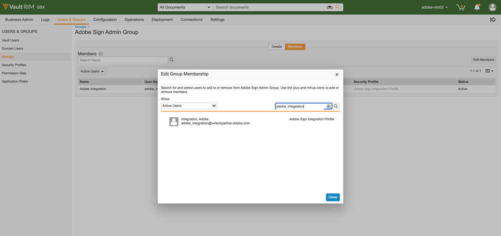
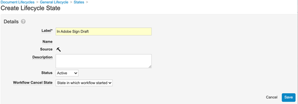
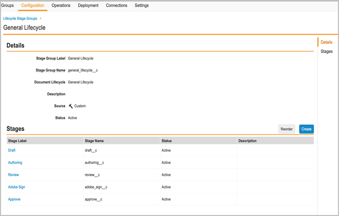
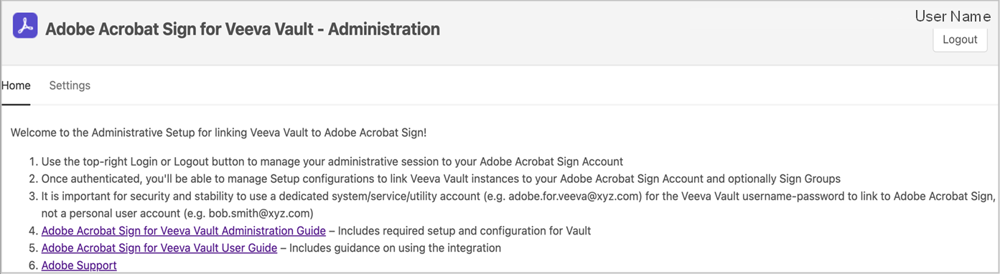
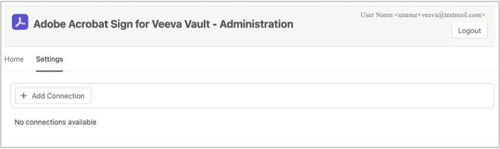
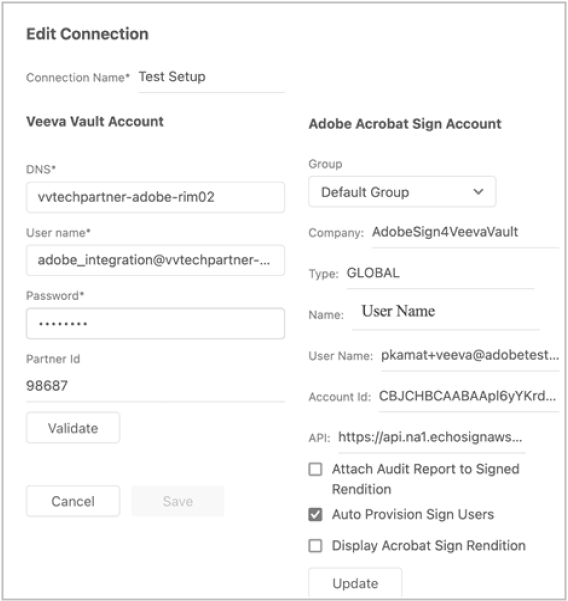
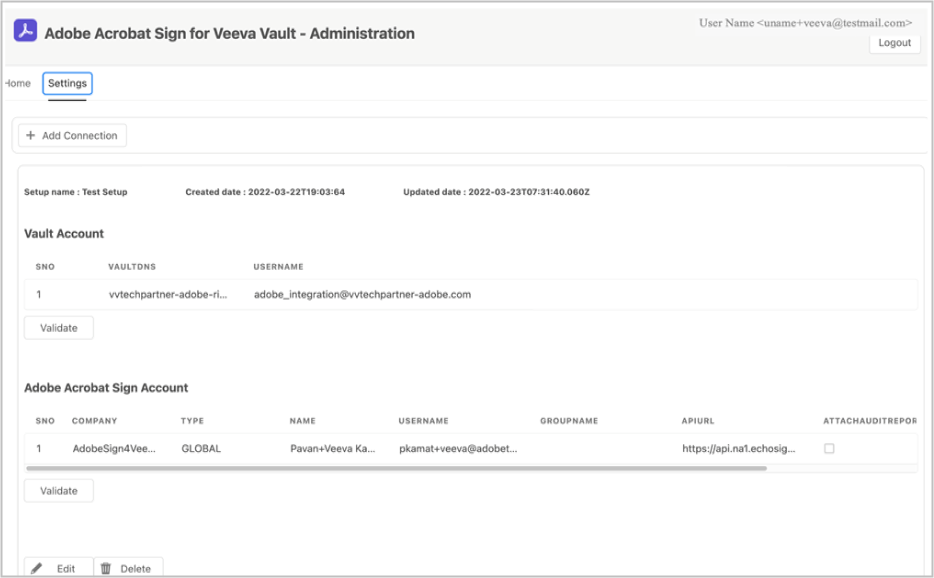

# [!DNL Veeva Vault] Guia de instalação{#veeva-installation-guide}

[**Entrar em contato com o Suporte do Adobe Sign**](https://adobe.com/go/adobesign-support-center_br)

## Visão geral {#overview}

Este documento explica como estabelecer a integração do Adobe Sign com [!DNL Veeva Vault] plataforma. [!DNL Veeva Vault] é uma plataforma de ECM (Enterprise Content Management, gerenciamento de conteúdo corporativo) desenvolvida para ciências biológicas. Um &quot;Cofre&quot; é um repositório de dados e conteúdo com uso típico para registros normativos, relatórios de pesquisa, aplicativos de concessões, contratos gerais e muito mais. Uma única empresa pode ter vários &quot;cofres&quot; que devem ser mantidos separadamente.

As etapas de alto nível para concluir a integração são:

* Ative sua conta administrativa no Adobe Sign (somente novos clientes).
* Crie objetos para controlar o histórico do ciclo de vida de um contrato no Vault.
* Crie um novo perfil de segurança.
* Configure um grupo no Adobe Sign para manter o [!DNL Veeva Vault] usuário de integração.
* Crie campos de documento e representações.
* Configurar ações da Web e atualizar o ciclo de vida do documento.
* Criar tipo de documento configuração de usuário e função de usuário.
* Conecte o Veeva Vault ao Adobe Sign usando middleware.

>[!NOTE]
>
>O administrador do Adobe Sign deve executar as etapas de configuração do Adobe Sign no Adobe Sign.

## Configure [!DNL Veeva Vault] {#configure-veeva}

Para configurar [!DNL Veeva Vault] para integração com o Adobe Sign, você precisa implementar as etapas listadas abaixo.

### Etapa 1. Criar grupo {#create-group}

Para configurar o Adobe Sign para [!DNL Vault], um novo grupo chamado *Adobe Sign Admin Group* é criado. Este grupo é usado para definir a segurança de nível de campo do documento para campos relacionados ao Adobe Sign e deve incluir *Perfil de integração do Adobe Sign* por padrão.

### Etapa 2. Implantar o pacote {#deploy-package}

[Implantar o pacote](https://helpx.adobe.com/content/dam/help/en/PKG-AdobeSign-Integration.zip) e siga as etapas. Depois de implantado, o pacote cria:

* Objetos personalizados: Objeto Signature, objeto Signatory, objeto Signature Event, objeto Process Locker
* Layout da página do objeto de assinatura
* Layout da página do objeto Evento de assinatura
* Layout de página do objeto Signatário
* Layout da página do objeto Process Locker
* Tipo de representação do Adobe Sign
* Assinatura de campo compartilhado__c , allow_adobe_sign_user_actions__c
* Ação da Web do Adobe Sign
* Cancelar ação do Adobe Sign na Web
* Conjunto de permissões das ações de administrador do Adobe Sign
* Perfil de segurança do Adobe Sign Integration Profile
* Função de aplicativo Adobe Sign Função de administrador
* Grupo de tipos de documento &quot;Documento do Adobe Sign&quot;

#### Objeto Signature {#signature-object}

O objeto de assinatura é criado para armazenar informações relacionadas ao contrato. Um objeto Signature é um banco de dados que contém informações nos seguintes campos específicos:

**Campos de objeto de assinatura**

| Campo | Rótulo | Tipo | Descrição |
| --- | --- | ---| --- | 
| external_id__c | ID do contrato | Sequência de caracteres (100) | Contém a ID de contrato exclusiva do Adobe Sign |
| file_hash__c | Hash de Arquivo | Sequência de caracteres (50) | Contém a soma de verificação md5 do arquivo que foi enviado para o Adobe Sign |
| name__v | Nome | Sequência de caracteres (128) | Mantém o nome do contrato |
| sender__c | Remetente | Objeto (Usuário) | Mantém a referência ao usuário do Vault que criou o contrato |
| signature_status__c | Status da assinatura | Sequência de caracteres (75) | Mantém o status do contrato no Adobe Sign |
| signature_type__c | Tipo de assinatura | Sequência de caracteres (20) | Contém o tipo de assinatura do contrato no Adobe Sign (MANUSCRITA ou ESIGN) |
| start_date__c | Data de início | DataHora | Data em que o contrato foi enviado para assinatura |
| cancellation_date__c | Data de cancelamento | DataHora | Mantém a data em que o contrato foi cancelado. |
| completed_date__c | Data de conclusão | DataHora | Mantém a data em que o contrato foi concluído. |
| viewable_rendition_used__c | Reprodução Visível Usada | Boolean | Sinalizador que indica se a representação visível foi enviada para assinatura. (por padrão, é verdadeiro) |

#### Objeto signatário {#signatory-object}

O objeto Signatário é criado para armazenar informações relacionadas aos participantes em um contrato. Contém informações nos seguintes campos específicos:

**Campos de objeto do signatário**

| Campo | Rótulo | Tipo | Descrição |
| --- | --- | ---| --- | 
| email__c | Email | Sequência de caracteres (120) | Contém a ID de contrato exclusiva do Adobe Sign |
| external_id__c | ID do participante | Sequência de caracteres (80) | Contém o identificador exclusivo do participante do Adobe Sign |
| name__v | Nome | Sequência de caracteres (128) | Mantém o nome do participante da Adobe Sign |
| order__c | Ordem | Número | Contém o número do pedido do participante do contrato do Adobe Sign |
| role__c | Função | Sequência de caracteres (30) | Mantém a função do participante do contrato do Adobe Sign |
| signature__c | Assinatura | Objeto (assinatura) | Mantém a referência ao registro pai da assinatura |
| signature_status__c | Status da assinatura | Sequência de caracteres (100) | Mantém o status do participante do contrato do Adobe Sign |
| user__c | Usuário | Objeto (Usuário) | Mantém a referência ao registro de usuário do signatário se o participante for um usuário do Vault |

#### Objeto Evento de assinatura {#signature-event}

O objeto Evento de assinatura é criado para armazenar informações relacionadas a eventos de um contrato. Contém informações nos seguintes campos específicos:

| Campo | Rótulo | Tipo | Descrição |
| --- | --- | ---| --- | 
| acting_user_email__c | Email do usuário em ação | Sequência de caracteres | Contém o email do usuário do Adobe Sign que executou a ação que gerou o evento |
| acting_user_name__c | Nome de usuário ativo | Sequência de caracteres | Contém o nome do usuário do Adobe Sign que executou a ação que gerou o evento |
| descrição__c | Descrição | Sequência de caracteres | Contém a descrição do evento do Adobe Sign |
| event_date__c | Data do evento | DataHora | Mantém a data e a hora do evento do Adobe Sign |
| event_type__c | Tipo de evento | Sequência de caracteres | Contém o tipo de evento do Adobe Sign |
| name__v | Nome | Sequência de caracteres | Nome do evento gerado automaticamente |
| participant_comment__c | Comentário do participante | Sequência de caracteres | Mantém o comentário do participante do Adobe Sign, se houver |
| participant_email__c | Email do participante | Sequência de caracteres | Contém o email do participante do Adobe Sign |
| participant_role__c | Função do participante | Sequência de caracteres | Mantém a função do participante do Adobe Sign |
| signature__c | Assinatura | Objeto (assinatura) | Mantém a referência ao registro pai da assinatura |

#### Objeto Process Locker {#process-locker}

Um objeto Process Locker é criado para bloquear o processo de integração do Adobe Sign. Não requer campos personalizados.

Os objetos Signature, Signatory, Signature Event e Process Locker que fazem parte do pacote de implantação têm a propriedade &quot;Audit data changes for this object&quot; ativada por padrão.

**Observação:** Para incluir as alterações de dados do registro do objeto de captura do Vault nos registros de auditoria, ative a configuração Alterações de dados de auditoria. Essa configuração fica desativada por padrão. Depois de ativar essa configuração e criar registros, você não poderá desativá-la. Se essa configuração estiver desativada e houver registros, somente um Proprietário do Vault poderá atualizá-la.

#### **Exibir participantes e histórico do objeto de assinatura** {#display-participants-history}

O objeto Signature que faz parte do pacote de implantação vem com o [Layout da página de detalhes da assinatura](https://vvtechpartner-adobe-rim.veevavault.com/ui/#admin/content_setup/object_schema/pagelayout?t=signature__c&amp;d=signature_detail_page_layout__c). O Layout de página tem seções para Participantes e Histórico.

* O *Participantes* A seção Objetos Relacionados está configurada conforme mostrado na imagem abaixo.

   

* Você pode editar as colunas a serem exibidas para os Participantes, conforme mostrado abaixo.

   

* O *Histórico* A seção Objetos Relacionados está configurada conforme mostrado na imagem abaixo.

   

* Você pode editar as colunas a serem exibidas no Histórico, conforme mostrado abaixo.

   

#### **Exibir participantes e histórico de auditoria do documento do Adobe Sign** {#view-participants-audit-history}

* Para exibir os Participantes e o histórico de auditoria do documento do Adobe Sign, selecione o link na seção &#39;Adobe Signature&#39; do documento.

   

* A página que é aberta exibe os Participantes e o Histórico do documento do Adobe Sign, conforme mostrado abaixo.

   

* Veja a trilha de áudio para assinatura conforme mostrado abaixo.

   

### Etapa 3. Configurar perfis de segurança {#security-profiles}

A implantação de pacote bem-sucedida na Etapa 2 cria o perfil de integração do Adobe Sign. O Perfil de integração do Adobe Sign é atribuído à conta do sistema e é usado pela integração ao chamar as APIs do Vault. Este perfil permite permissões para:

* APIs do Vault
* Lendo, criando, editando e excluindo: Assinatura, Assinatura, Eventos de assinatura e objetos do Process Locker

Você deve atualizar o Adobe Sign Admin Group (criado na Etapa 1) definindo o perfil de segurança incluído como Perfil de integração do Adobe Sign, conforme mostrado na imagem abaixo.

### Etapa 4. Criar usuário {#create-user}

O usuário da conta de sistema do Vault da integração do Adobe Sign deve:

* Ter um perfil de integração do Adobe Sign
* Tem um perfil de segurança
* Tem uma política de segurança específica que desativa a expiração da senha
* Seja membro do Adobe Sign Admin Group.

Para isso, siga as etapas abaixo:

1. Crie uma conta do sistema do Vault que seja usuário da integração do Adobe Sign.

   

2. Adicione o usuário ao Adobe Sign Admin Group.

   

### Etapa 5. Configurar Grupo de Tipos de Documento {#create-document-type-group}

Quando você implanta o pacote do Adobe Sign, ele cria um registro de Grupo de tipos de documento chamado &quot;Documento do Adobe Sign&quot;.

Você precisa adicionar esse grupo de tipos de documento para todas as classificações de documento elegíveis para o processo do Adobe Sign. Como a propriedade de grupo de tipo de documento não é herdada do tipo para o subtipo nem do subtipo para o nível de classificação, ela deve ser definida para cada classificação de documento elegível para o Adobe Sign.

**Observação:** Se o objeto Configuração da função do usuário não contiver o campo que se refere ao objeto Grupo de tipos de documento, você deverá adicionar o campo. Para isso, vá para **[!UICONTROL Objeto]** > **[!UICONTROL Configuração de Função de Usuário]** > **[!UICONTROL Campos]** e conclua as etapas necessárias, conforme mostrado na imagem abaixo.

### Etapa 6. Criar Configuração de Função de Usuário {#create-user-role-setup}

Depois que o(s) ciclo(s) de vida estiver(em) configurado(s) corretamente, o sistema deve garantir que o usuário administrador do Adobe Sign seja adicionado pelo DAC para todos os documentos qualificados para o processo do Adobe Sign. Isso é feito criando o registro apropriado de Configuração de função de usuário que especifica:

* Tipo de documento Grupo como documento do Adobe Sign
* Função do aplicativo como função de administrador do Adobe Sign
* Usuário de integração

### Etapa 7. Configurar Campos de Documento {#create-fields}

A implantação do pacote cria os seguintes dois novos campos de documento compartilhado que são necessários para estabelecer a integração:

* Assinatura (signature__c)
* Permitir ações do usuário do Adobe Sign (allow_adobe_sign_user_actions__c)

Para configurar Campos de documento:

1. Vá para a guia Configuração e selecione **[!UICONTROL Campos de documento]** > **[!UICONTROL Campos compartilhados]**.
1. No campo Seção de Exibição, selecione **[!UICONTROL Criar Seção de Exibição]** e atribuir **[!UICONTROL Assinatura Adobe]** como o rótulo Seção.

   

1. Para os dois campos de Documento compartilhado (signature__c e allow_adobe_sign_user_actions__c), atualize a seção da interface do usuário com **[!UICONTROL Assinatura Adobe]** como o rótulo da seção.
1. Adicione os três campos compartilhados a todos os tipos de documento qualificados para assinatura Adobe. Para fazer isso, na página Documento base, selecione **[!UICONTROL Adicionar]** > **[!UICONTROL Campo compartilhado existente]** no canto superior direito.

   

   

   

1. Observe que ambos os campos devem ter uma segurança específica que permita que apenas os membros do Adobe Sign Admin Group atualizem seus valores.

   

Desativar Sobreposições do Vault (disable_vault_overlay__v) é um campo compartilhado existente. Opcionalmente, o campo pode ter uma segurança específica que permite que apenas membros do grupo de administradores do Adobe Sign atualizem seu valor.

### Etapa 8. Declarar representações de documento {#declare-renditions}

O novo tipo de representação chamado *Adobe Sign Rendition (adobe_sign_rendition__c)* é usado pela integração do Vault para carregar documentos PDF assinados no Adobe Sign. É necessário declarar a representação Adobe Sign para cada tipo de documento qualificado para assinatura Adobe.

### Etapa 9. Atualizar ações da Web {#web-actions}

A integração do Adobe Sign e do Vault exige que você crie e configure as duas ações da Web a seguir:

* **Criar Adobe Sign**: Ele cria ou exibe o Contrato do Adobe Sign.

   Tipo: Destino do documento: Exibir dentro das Credenciais do Vault: Habilitar credenciais de Post Session via URL de Post Message: <https://api.na1.adobesign.com/api/gateway/veevavaultintsvc/partner/agreement?docId=${Document.id}&majVer=${Document.major_version_number__v}&minVer=${Document.minor_version_number__v}&vaultid=${Vault.id}&useWaitPage=true>

   

* **Cancelar Adobe Sign**: Ele cancela um contrato existente no Adobe Sign e reverte o estado de um documento para o estado inicial.

   Tipo: Destino do documento: Exibir dentro das Credenciais do Vault: Habilitar credenciais de Post Session via URL de Post Message: : <https://api.na1.adobesign.com/api/gateway/veevavaultintsvc/partner/agreement/cancel?docId=${Document.id}&majVer=${Document.major_version_number__v}&minVer=${Document.minor_version_number__v}&vaultid=${Vault.id}&useWaitPage=true>

   

### Etapa 10. Atualizar ciclo de vida do documento {#document-lifecycle}

Para cada tipo de documento qualificado para a Assinatura Adobe, você deve atualizar o ciclo de vida do documento correspondente adicionando novos estados e funções do ciclo de vida.

O ciclo de vida do contrato do Adobe Sign tem os seguintes estados:

* RASCUNHO
* AUTHORING ou DOCUMENTS_NOT_YET_PROCESSED
* OUT_FOR_SIGNATURE ou OUT_FOR_APPROVAL
* ASSINADO ou APROVADO
* CANCELADO
* EXPIRADO

Para atualizar o ciclo de vida do documento, siga as etapas abaixo:

1. Adicionar função de Ciclo de Vida. A função do aplicativo de administração do Adobe Sign deve ser adicionada em todos os ciclos de vida usados por documentos qualificados para assinatura Adobe, conforme mostrado abaixo.

   

   A função de administrador deve ser criada com as seguintes opções:

   * Habilitado o Controle de Acesso Dinâmico.
   * Regras de compartilhamento de documentos que incluem apenas Grupo de tipos de documentos, conforme mostrado na imagem abaixo.

   

2. Crie estados do ciclo de vida. Para isso, vá para **[!UICONTROL Configurações]** > **[!UICONTROL Configuração]** > **[!UICONTROL Ciclos de vida do documento]** > **[!UICONTROL Ciclos de vida gerais]** > **[!UICONTROL Estados]** > **[!UICONTROL Criar]**. Em seguida, crie os seguintes estados:

   * No Adobe Sign Draft

   

   * Na criação do Adobe Sign

   

   * Assinatura no Adobe

   

3. Adicione ações do usuário aos estados listados abaixo.

   Quando um documento do Vault é enviado para o Adobe Sign, seu estado deve corresponder ao estado em que o contrato está. Para fazer isso, adicione os seguintes estados em cada ciclo de vida usado por documentos qualificados para assinatura Adobe:

   * **Antes da assinatura do Adobe** (Revisado): Este é um nome de espaço reservado para o estado a partir do qual o documento pode ser enviado ao Adobe Sign. Com base no tipo de documento, ele pode ser Estado de rascunho ou Revisado. O rótulo de estado do documento pode ser personalizado de acordo com os requisitos do cliente. Antes da assinatura do Adobe, o estado deve definir as duas seguintes ações do usuário:

      * Ação que altera o estado do documento para *No Adobe Sign Draft* estado. O nome desta ação do usuário deve ser o mesmo para todos os tipos de documento de qualquer ciclo de vida. Se necessário, os critérios para essa ação podem ser definidos como &quot;Permitir ações do usuário do Adobe Sign é igual a Sim&quot;.
      * Ação que chama a Ação da Web &quot;Adobe Sign&quot;. Esse estado deve ter segurança que permita que a função de administrador do Adobe Sign: exibir documento, exibir conteúdo, editar campos, editar relacionamentos, baixar origem, gerenciar representação visível e alterar estado.

      

   * **No Adobe Sign Draft**: Este é um nome de espaço reservado para o estado que indica que o documento já foi carregado no Adobe Sign e que seu contrato está em um estado RASCUNHO. É um estado obrigatório. Esse estado deve definir as cinco ações do usuário a seguir:

      * Ação que altera o estado do documento para *Na criação do Adobe Sign* estado. O nome desta ação do usuário deve ser o mesmo para todos os tipos de documento de qualquer ciclo de vida. Se necessário, os critérios para essa ação podem ser definidos como &quot;Permitir ações do usuário do Adobe Sign é igual a Sim&quot;.
      * Ação que altera o estado do documento para *No estado de assinatura Adobe*. O nome desta ação do usuário deve ser o mesmo para todos os tipos de documento de qualquer ciclo de vida. Se necessário, os critérios para essa ação podem ser definidos como &quot;Permitir ações do usuário do Adobe Sign é igual a Sim&quot;.
      * Ação que altera o estado do documento para *Adobe Sign Cancelado* estado. O nome desta ação do usuário deve ser o mesmo para todos os tipos de documento de qualquer ciclo de vida. Se necessário, os critérios para essa ação podem ser definidos como &quot;Permitir ações do usuário do Adobe Sign é igual a Sim&quot;.
      * Ação que chama a Ação da Web &quot;Adobe Sign&quot; .
      * Ação que chama a Ação da Web &quot;Cancelar Adobe Sign&quot;. Esse estado deve ter segurança que permita que a função Administrador do Adobe Sign: exibir documento, exibir conteúdo, editar campos, editar relacionamentos, baixar origem, gerenciar representação visível e alterar estado.

      

   * **Na criação do Adobe Sign**: É um nome de espaço reservado para o estado que indica que o documento já foi carregado no Adobe Sign e que seu contrato está no estado AUTHORING ou DOCUMENTS_NOT_YET_PROCESSED. É um estado obrigatório. Esse estado deve ter quatro ações de usuário definidas:

      * Ação que altera o estado do documento para o estado Cancelado do Adobe Sign. O nome desta ação do usuário deve ser o mesmo para todos os tipos de documento, independentemente do ciclo de vida. Se necessário, os critérios para essa ação podem ser definidos como &quot;Permitir ações do usuário do Adobe Sign é igual a Sim&quot;.
      * Ação que altera o estado do documento para No estado de assinatura do Adobe. O nome desta ação do usuário deve ser o mesmo para todos os tipos de documento, independentemente do ciclo de vida. Se necessário, os critérios para essa ação podem ser definidos como &quot;Permitir ações do usuário do Adobe Sign é igual a Sim&quot;.
      * Ação que chama a Ação da Web &quot;Adobe Sign&quot;
      * Ação que chama a Ação da Web &quot;Cancelar Adobe Sign&quot;. Esse estado deve ter segurança que permita que a função Administrador do Adobe Sign: exibir documento, exibir conteúdo, editar campos, editar relacionamentos, baixar origem, gerenciar representação visível e alterar estado.

      

   * **Assinatura no Adobe**: É um nome de espaço reservado para o estado que indica que o documento foi carregado no Adobe Sign e que seu contrato já foi enviado aos participantes (estado OUT_FOR_SIGNATURE ou OUT_FOR_APPROVAL). É um estado obrigatório. Esse estado deve ter as seguintes cinco ações de usuário definidas:

      * Ação que altera o estado do documento para o estado Cancelado do Adobe Sign. O estado de destino dessa ação pode ser qualquer requisito do cliente e pode ser diferente para diferentes tipos. O nome desta ação do usuário deve ser o mesmo para todos os tipos de documento, independentemente do ciclo de vida. Se necessário, os critérios para essa ação podem ser definidos como &quot;Permitir ações do usuário do Adobe Sign é igual a Sim&quot;.
      * Ação que altera o estado do documento para o estado Adobe Sign Rejeitado. O estado de destino dessa ação pode ser qualquer requisito do cliente e pode ser diferente para diferentes tipos. O nome desta ação do usuário deve ser o mesmo para todos os tipos de documento, independentemente do ciclo de vida. Se necessário, os critérios para essa ação podem ser definidos como &quot;Permitir ações do usuário do Adobe Sign é igual a Sim&quot;.
      * Ação que altera o estado do documento para Adobe Assinado. O estado de destino dessa ação pode ser qualquer requisito do cliente e pode ser diferente para diferentes tipos. No entanto, o nome dessa ação do usuário deve ser o mesmo para todos os tipos de documento, independentemente do ciclo de vida. Se necessário, os critérios para essa ação podem ser definidos como &quot;Permitir ações do usuário do Adobe Sign é igual a Sim&quot;.
      * Ação que chama a Ação da Web *Adobe Sign*.
      * Ação que chama a Ação da Web *Cancelar Adobe Sign*. Esse estado deve ter segurança que permita que a função Administrador do Adobe Sign: exibir documento, exibir conteúdo, editar campos, editar relacionamentos, baixar origem, gerenciar representação visível e alterar estado.

      

      * **Adobe Assinado (Aprovado)**: Este é um nome de espaço reservado para o estado que indica que o documento foi carregado no Adobe Sign e que seu contrato foi concluído (estado SIGNED ou APPROVED). É um estado obrigatório e pode ser um estado do ciclo de vida existente, como Aprovado.
Esse estado não requer ações do usuário. Ele deve ter uma segurança que permita que a função Administrador do Adobe Sign: exibir documentos, exibir conteúdo e editar campos.

   O diagrama a seguir ilustra os mapeamentos entre o contrato do Adobe Sign e os estados do documento do Vault, em que o estado &quot;Antes da assinatura do Adobe&quot; é Rascunho.

   

### Etapa 11. Adicionar estágio do Adobe Sign ao Ciclo de vida geral em grupos do Estágio do Ciclo de Vida

### Etapa 12. Definir permissões para Função de Usuário no estado do Ciclo de Vida

Você deve definir as permissões apropriadas para cada Função de Usuário no Estado do Ciclo de Vida, conforme mostrado na imagem abaixo.

### Etapa 13. Configurar a segurança atômica com base no estado do documento e na função de usuário

### Etapa 14. Criar mensagens de documento para Adobe Sign Cancelar

## Conectar [!DNL Veeva Vault] para o Adobe Sign usando middleware {#connect-middleware}

Depois de concluir a configuração para [!DNL Veeva Vault] e a conta de administrador do Adobe Sign, o administrador deve criar uma conexão entre as duas contas usando o middleware. O [!DNL Veeva Vault] e a conexão de conta da Adobe Sign é iniciada pela Adobe Sign Identity e, em seguida, é usada para armazenar o[!DNL Veeva Vault]identidade.
Para segurança e estabilidade do sistema, o administrador deve usar um [!DNL Veeva Vault] conta de sistema/serviço/utilitário, como `adobe.for.veeva@xyz.com`, em vez de uma conta de usuário pessoal, como `bob.smith@xyz.com`.

Um administrador de conta da Adobe Sign deve seguir as etapas abaixo para se conectar [!DNL Veeva Vault] para o Adobe Sign usando middleware:

1. Vá para a [Adobe Sign para [!DNL Veeva Vault] Página inicial](https://static.adobesigncdn.com/veevavaultintsvc/index.html).
1. Selecionar **[!UICONTROL Login]** no canto superior direito.

   

1. Na página de logon do Adobe Sign que é aberta, forneça o email e a senha do administrador da conta e selecione **[!UICONTROL Fazer logon]**.

   

   Após o logon bem-sucedido, a página exibe a ID de e-mail associada e uma guia Configurações, conforme mostrado abaixo.

   

1. Selecione o **[!UICONTROL Configurações]** guia.

   A página Configurações exibe as conexões disponíveis e mostra *Nenhuma conexão disponível* no caso da primeira configuração de conexão, conforme mostrado abaixo.

   

1. Selecionar **[!UICONTROL Adicionar conexão]** para adicionar uma nova conexão.

1. Na caixa de diálogo Adicionar conexão que é aberta, forneça os detalhes necessários, incluindo o [!DNL Veeva Vault] credenciais.

   As credenciais do Adobe Sign são preenchidas automaticamente a partir do logon inicial do Adobe Sign.

   

1. Selecionar **[!UICONTROL Validar]** para validar os detalhes da conta.

   Após a validação bem-sucedida, você verá uma notificação &quot;Usuário validado com êxito&quot;, conforme mostrado abaixo.

   

1. Para restringir o uso a um grupo do Adobe Sign específico, expanda a **[!UICONTROL Grupo]** e selecione um dos grupos disponíveis.

   

1. Para anexar o relatório de auditoria à representação assinada, marque a caixa de seleção **[!UICONTROL Anexar relatório de auditoria à representação assinada]**.

   

1. Para permitir o provisionamento automático de usuários no Adobe Sign, marque a caixa de seleção **[!UICONTROL Provisionamento automático de usuários do Sign]**.

   **Observação:** O Provisionamento automático de novos usuários do Adobe Sign funciona somente se tiver sido ativado no nível de conta do Adobe Sign no Adobe Sign, além de ativar **[!UICONTROL Provisionamento automático de usuários do Sign]** para[!DNL Veeva Vault]Integração com o Adobe Sign, conforme mostrado abaixo pelo administrador de conta do Adobe Sign.

   

1. Selecionar **[!UICONTROL Salvar]** para salvar a nova conexão.

   A nova conexão é exibida na guia Configurações, mostrando uma integração bem-sucedida entre [!DNL Veeva Vault] e Adobe Sign.

   

